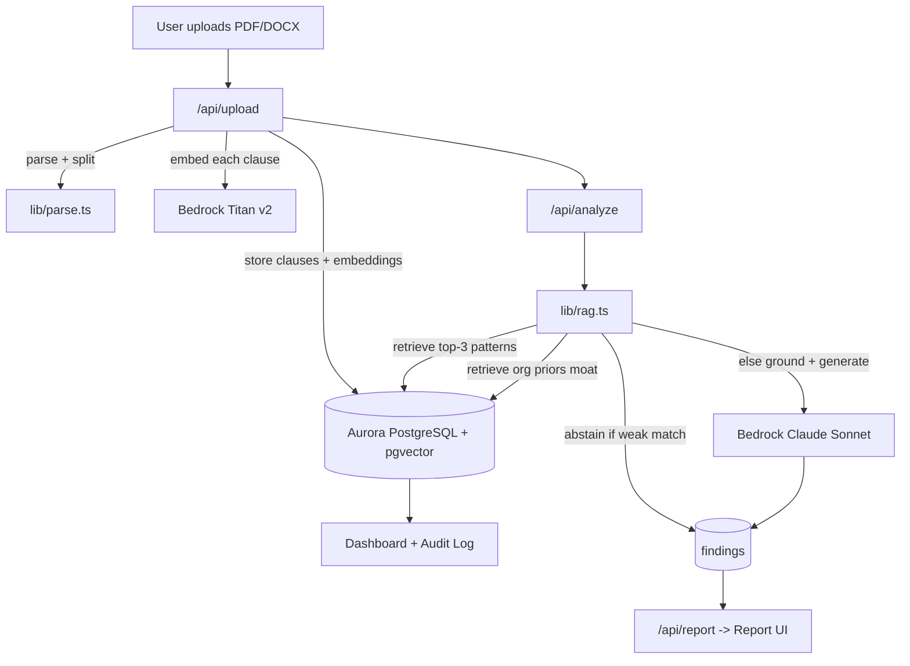

# ClauseGuard

**The legal contract review small businesses can't afford.** Upload any contract and get every
risky clause flagged, explained in plain English, and rewritten with safer language — in ~30 seconds.

[](https://clauseguard.vercel.app)
&nbsp;[](./DECK.pdf)


> AWS × Vercel Hackathon · **Track 2 (Monetizable B2B)** · Amazon Aurora PostgreSQL + pgvector RAG,
> grounded on Amazon Bedrock (Claude). Flagship submission — target: **Best Technical Implementation**.

> 🟢 **Live:** https://clauseguard.vercel.app &nbsp;·&nbsp; 📊 **Pitch deck:** [DECK.pdf](./DECK.pdf)

---

## Why this is real RAG (not a lookup)

Most "AI clause checkers" do a vector lookup and return canned text — they can't flag anything outside
their seed list. ClauseGuard does **true Retrieval-Augmented Generation**:

1. **Retrieve** the most similar known-risky patterns from a curated clause library (`pgvector`).
2. **Abstain** when the nearest pattern is too weak a match — it says *"needs human review"* instead of
   inventing legal risk. A legal tool that knows what it doesn't know is the one you can trust.
3. **Generate** a finding tailored to *this clause's exact wording*, grounded on the retrieved patterns,
   with a redline diff — so it generalizes to clauses never seen before.
4. **The moat:** a second `pgvector` search over the org's **own past contracts** surfaces
   *"you accepted similar language in 3 past contracts."* Relational data + vector search in **one
   Aurora query path** — which is precisely why Aurora PostgreSQL is the correct database.

---

## Architecture



**Stack:** Next.js 16 (App Router) · TypeScript · Tailwind v4 / shadcn · Amazon Aurora PostgreSQL
(Serverless v2) + pgvector · Amazon Bedrock (Titan Text Embeddings V2 + Claude Sonnet) · deploys to
Vercel.

---

## Project structure

```
app/
  page.tsx                     Landing
  upload/                      Dropzone + recent contracts (real upload→analyze→report)
  report/[contractId]/         Risk report (banner, clause cards, redline diff, moat, abstention)
  dashboard/                   Contracts table + compliance audit log
  pricing/
  api/
    upload/   analyze/   report/   redline/   contracts/   audit/
lib/
  db.ts          Aurora pooled client (lazy), transactions, pgvector helpers
  embeddings.ts  Bedrock Titan v2 embeddings
  parse.ts       PDF/DOCX/TXT extraction + clause splitting + type heuristics
  rag.ts         TRUE RAG core: retrieve → abstain | generate, prior-exposure, <del>/<ins> redline
  scoring.ts     Risk aggregation + ContractReport assembly
  queries.ts     Shared data access (mock fallback so UI renders pre-Aurora)
  context.ts     Tenant (org/user) resolution
  audit.ts       Compliance audit trail
  data.ts        Canonical TS interfaces + demo mock data
db/
  schema.sql            Full schema (vector(1024))
  clause-patterns.mjs   30 curated risky-clause patterns (the RAG knowledge base)
scripts/
  run-sql.mjs   seed.mjs
docs/
  v0-ui-spec.md   stitch-ui-spec.md
```

---

## Setup

### 1. Prerequisites
- An **Amazon Aurora PostgreSQL (Serverless v2)** cluster with the `vector` extension available.
- **Amazon Bedrock** model access granted in your region for:
  `amazon.titan-embed-text-v2:0` and `anthropic.claude-sonnet-4-6`.

### 2. Environment
```bash
cp .env.example .env.local
# Fill in DATABASE_URL, AWS_REGION, AWS credentials, model IDs.
```

### 3. Database
```bash
pnpm install
pnpm db:schema   # applies db/schema.sql (creates tables + pgvector indexes)
pnpm db:seed     # embeds the 30 patterns via Bedrock + seeds a demo org/users
```
The seed prints a **demo org id** — optionally set it as `ORG_ID` in `.env.local` to pin the tenant.

### 4. Run
```bash
pnpm dev         # http://localhost:3000
```
Upload a contract on `/upload` → it parses, embeds, runs the RAG pipeline, and redirects to the report.

> **No Aurora/Bedrock yet?** The UI still renders with demo data (a "Demo data — connect Aurora to go
> live" badge appears). Everything switches to live data once `DATABASE_URL` + Bedrock are configured.

---

## API

| Route | Method | Purpose |
|---|---|---|
| `/api/upload` | POST (multipart) | Parse → split → embed → store clauses |
| `/api/analyze` | POST `{contractId}` | Run RAG over every clause, store findings, score overall risk |
| `/api/report?contractId=` | GET | Full `ContractReport` for the report UI |
| `/api/redline` | POST `{clauseText}` | On-demand safer-language rewrite for one clause |
| `/api/contracts` | GET | Contracts list (dashboard / recent) |
| `/api/audit` | GET | Compliance audit entries |

---

## Deploy (Vercel)

1. Import the repo into Vercel.
2. Set the same environment variables (`DATABASE_URL`, `AWS_REGION`, AWS credentials, model IDs) in the
   Vercel project settings. Prefer an IAM role / scoped keys with Bedrock + RDS access.
3. Deploy. The `/api/upload` and `/api/analyze` functions are configured for the Node.js runtime with
   extended `maxDuration` for the embedding + LLM calls.

Run `pnpm db:schema && pnpm db:seed` once against the production Aurora cluster before the first demo.

---

## The three things to show judges (90 seconds)
1. Open a **HIGH** finding → tailored plain-English explanation + **redline diff** against the actual wording.
2. The **moat shot:** *"you accepted similar language in 3 past contracts"* (cross-contract pgvector join).
3. An **abstention** card: *"needs human review."* Calibrated uncertainty = trust.

> *"Amazon Aurora PostgreSQL with pgvector powers our RAG — retrieval over a curated clause library AND
> the customer's own contract history, with full ACID for the compliance audit log. One database, both
> jobs. Generation runs on Amazon Bedrock."*
